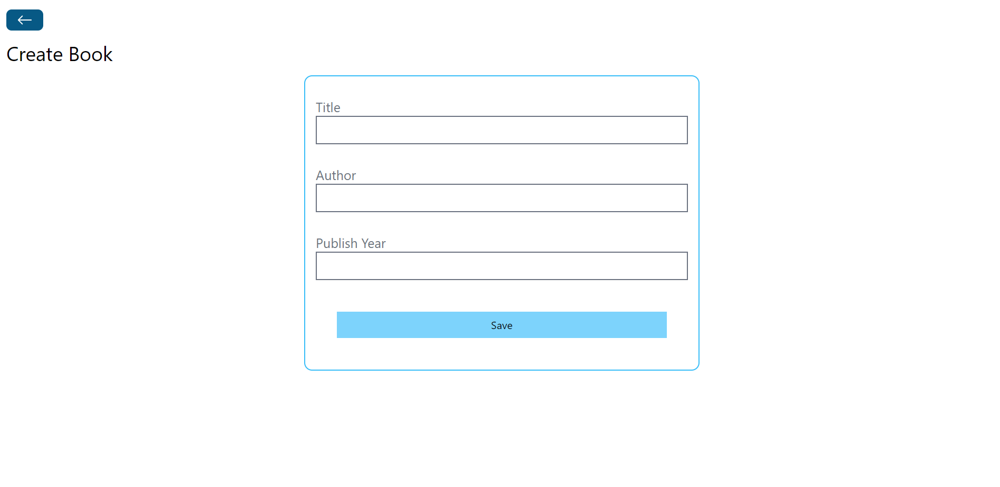

# BOOK STORE

## MERN STACK IMPLEMENTATION WITH BOOK STORE PROJECT

### BACKEND

--> Initially Backend for the project was created with the help of Mongodb and Express js.

--> The mongoose library was installed in order to connect the mongodb with the project and assign the modal for the database.

--> Created modals for Book Title, Author, Publish Year.

-->Integrated the Book Modal with various functions that can be used to apply in the database.

### FRONTEND

--> Used React Library in order to create various components and pages.

--> The CRUD operations are implemented in order for the working of the project.

#### BookTable page

#### CreateBook page

--> The + - icon in the BookTable page helps in adding the book information to the table.

#### EditBook page

--> This pen-icon in the BookTable page will redirect to the edit page and the update will also be reflected in the book table page as well as in the database of the project.

#### Book Information page

--> The i-icon in the BookTable page gives the information about the page and will be redirected to the information page.

#### DeleteBook page

--> The bin-icon in the BookTable page is used to delete the Book record from the table as well as from the database.

## SUMMARY

     The project mainly focuses on storing various Books and the information about the various books. The user can perform the operations, as the suitables have been given in the web page. The user are provided the privilege of creating, updating and deleting the book and its information. This web page will be user-friendly and user will not be facing any sort of difficulties.

# HOPE THIS PROJECT WILL BE ENJOYABLE...

